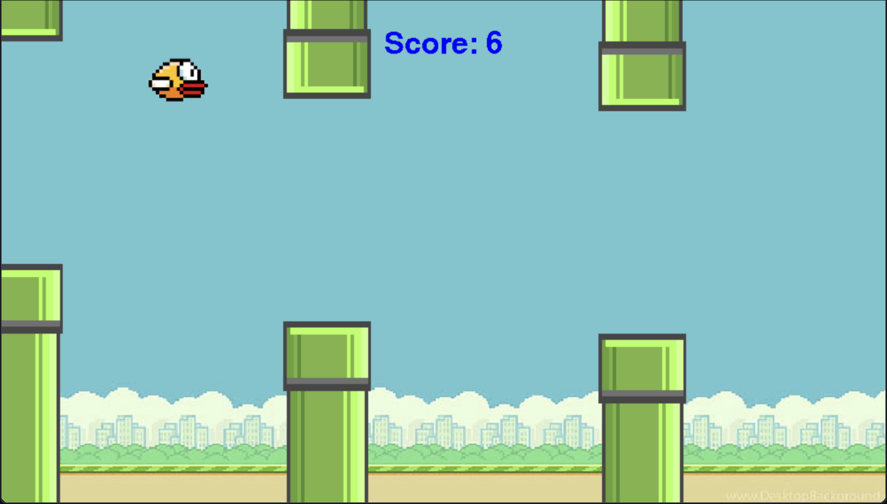

# Flappy Bird Clone (Pygame)

A simple Flappy Bird clone made using Python and the Pygame library. This project is a great starting point for learning basic game development concepts such as gravity, collision detection, and sprite handling.



## 🎮 How to Play

- Press `SPACE` to start the game.
- Press `SPACE` to make the bird jump.
- Avoid the pipes and try to survive as long as possible.
- The longer you survive, the higher your score.

## 📁 Project Structure

```
Flappy_Bird/
├── images/
│   ├── background.jpg
│   ├── bird.png
│   ├── pipe_up.tiff
│   └── pipe_down.tiff
├── flappy_bird.py
├── README.md
└── requirements.txt
```

## 🛠 Features

- Simple and smooth gameplay
- Realistic gravity and jumping physics
- Random pipe generation
- Collision detection
- Score display based on survival time
- Game restart on death

## 📦 Requirements

Install the required libraries with:

```bash
pip install -r requirements.txt
```

## ▶️ Running the Game

Make sure you have Python and Pygame installed. Then run:

```bash
python flappy_bird.py
```

## 📝 Notes

- Make sure the image assets are in the correct directory: `images/`
- Update file paths in the script if you move the assets or run from a different working directory
- The game is built for a window size of 1000x570 pixels

## 💡 Credits

Inspired by the original *Flappy Bird* game by Dong Nguyen
